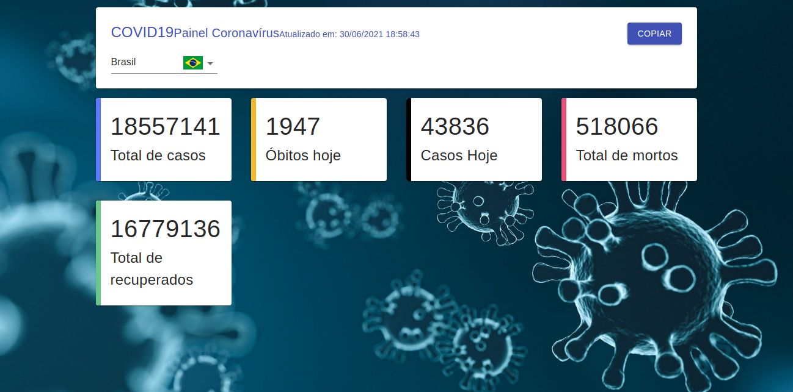

<h1 align="center">
  Covid-19
</h1>

<p align="center">
  <a href="#-tecnologias">Tecnologias</a>&nbsp;&nbsp;&nbsp;|&nbsp;&nbsp;&nbsp;
  <a href="#-projeto">Projeto</a>&nbsp;&nbsp;&nbsp;|&nbsp;&nbsp;&nbsp;
  <a href="#-execução">Execução</a>&nbsp;&nbsp;&nbsp;|&nbsp;&nbsp;&nbsp;
  <a href="#-contribuindo">Contribuindo</a>&nbsp;&nbsp;&nbsp;|&nbsp;&nbsp;&nbsp;
  <a href="#-licença">Licença</a>
</p>

<br>

<p align="center">
  
</p>

## ✨ Tecnologias

`HTML`   
`CSS`   
`JavaScript`   
`ReacrJS`   

## 💻 Projeto

Desenvolvimento de um site par exibir os números do covid19. trabalho feito no curso de reactJS na plataforma da <a href="https://digitalinnovation.one/">Digital Inovation One</a>

## 🚀 Execução

Primeiro faça o clone do projeto

```sh
git clone https://github.com/dmssantos/covid-19.git
```
agora instale as dependências
```sh
npm install @material-ui/core styled-components@^5.0.0
```
execute o projeto
```sh
npm run start
```
acesse a página no localhost:3000

## 🤝 Contribuindo

Obrigado por estar interessado em tornar este projeto melhor. Encorajo todos a ajudar a melhorar este projeto com novos recursos, correções de bugs ou melhorias de desempenho.

## 📄 Licença

Esse projeto está sob a licença MIT. Veja o arquivo [LICENSE](LICENSE.md) para mais detalhes.

##

<p align="center">
  ©<a href="https://github.com/dmssantos"> David Santos</a>
</p>
